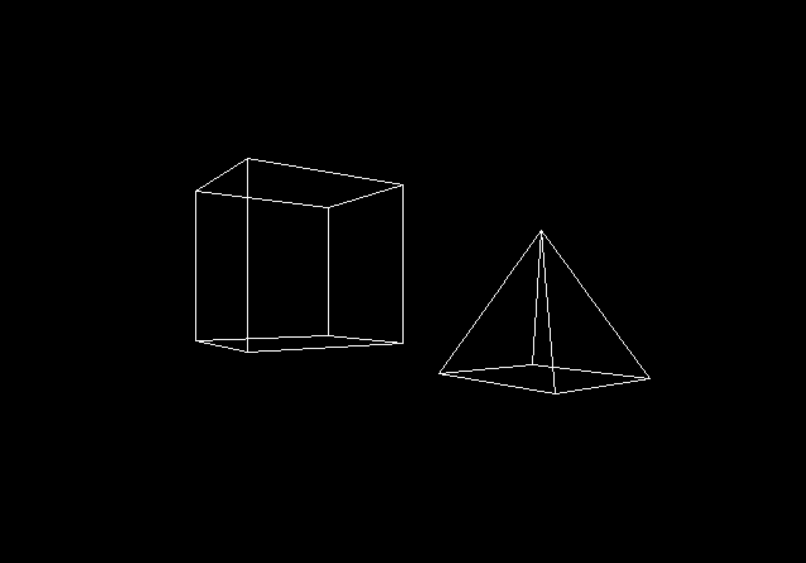
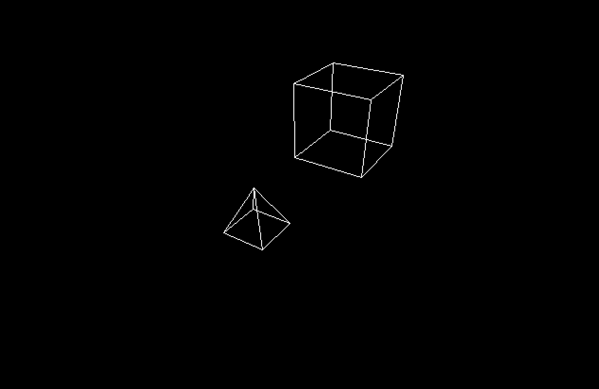

# Project Description

This is a simple 3D renderer that I built in August 2024 after taking a Linear Algebra course at my university. The project was a way for me to put into practice the mathematical concepts I had just learned, particularly deriving a perspective projection formula and applying rotation matrices to manipulate objects and the camera in 3D space.

The renderer is still an early prototype. There are many features I would like to add, as well as several opportunities for optimization and code cleanup. I plan to continue developing it whenever I have the time.

## Building

To compile the project, run: `make`

**Requirements:**

* A C++ compiler (GCC or compatible)
* SDL2 development libraries installed

## Running

After compiling, run: `./main`

(On Windows, execute `main.exe`.)

### Some screenshots:

